QGIS y OpenStreetMap (OSM): ¿Cuántas edificaciones hay en una región?
=====================================================================

En esta entrada utilizaremos en conjunto QGIS y OpenStreetMap para
identificar edificaciones dentro de la franja de arena donde se
encuentra la ciudad de Puntarenas, Costa Rica. Asumiremos que el
ejercicio es parte de una cuantificación de futuros daños que podría
sufrir la ciudad de Puntarenas dado al aumento del nivel del mar
asociado al cambio climático y vendría a funcionar como un ejemplo.

QGIS es un programa de Sistemas de Información Geográfica (SIG) gratuito
y de código abierto con una interfaz gráfica amigable al usuarios
disponible para distintas plataformas. Actualmente es la opción gratuita
más completa y fácil de usar para realizar análisis de datos espaciales.
QGIS se puede descargar desde
[[www.qgis.org]{.underline}](https://www.qgis.org/en/site/forusers/download.html)

OpenStreetMap (OSM) es una plataforma colaborativa en internet para
crear mapas editables y libres. En esta plataforma cualquier persona
puede modificar, editar y agregar información espacial sobre cualquier
lugar en el mundo. Se podría decir que OpenStreetMap es un Wikipedia de
mapas, donde los datos generados no solamente se pueden desplegar en el
sitio web de la plataforma, si no que también pueden descargarse y ser
analizados en herramientas de SIG. A pesar de que los datos que se
presentan en OSM no son oficiales, en muchos regiones del mundo son los
únicos existentes, por lo que se deben considerar como una fuente
importante de datos geográficos libres y gratuitos.

### Objetivo del tutorial:

-   Identificar y analizar utilizando QGIS y OSM las distintas
    > edificaciones que existen en la franja de arena donde se encuentra
    > la ciudad de Puntarenas, en Costa Rica

### Notas para tomar en cuenta durante el tutorial:

> El tutorial se realizará utilizando la versión en inglés de **QGIS
> versión 3.4**
>
> Se recomienda hacer este tutorial luego del anterior tutorial
> **Creando mapas en QGIS**

Parte 1. Enfocando nuestro análisis al área de Puntarenas
---------------------------------------------------------

Para comenzar nuestro análisis debemos enfocarnos en nuestra área de
estudio y para esto debemos utilizar varias herramientas de QGIS.

1.  Abrir QGIS dando doble click al ícono.

> 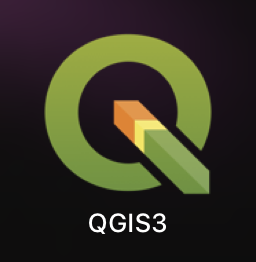{width="1.0677088801399826in"
> height="1.1000634295713037in"}

2.  Agregar mapa base de OpenStreetMap al visor de QGIS utilizando la
    > ventana de *Browser* y la opción de *XYZ Tiles* y dando doble
    > click a *OpenStreetMap*.

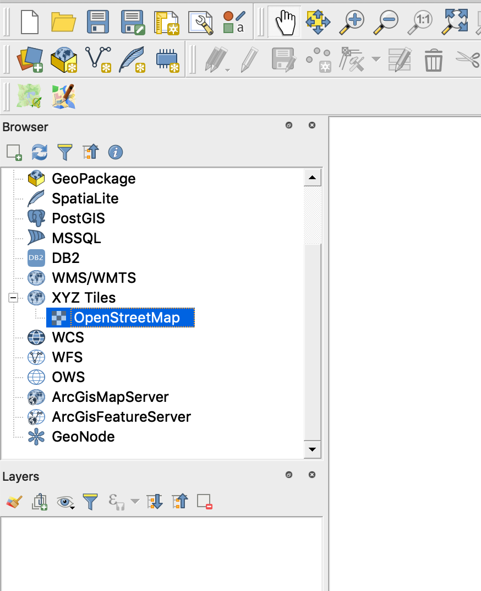{width="3.4279582239720034in"
height="4.203125546806649in"}

Al hacer esto el mapa del mundo se despliega en la ventana principal de
QGIS y en la ventana de *Layers* nos aparece *OpenStreetMap*.

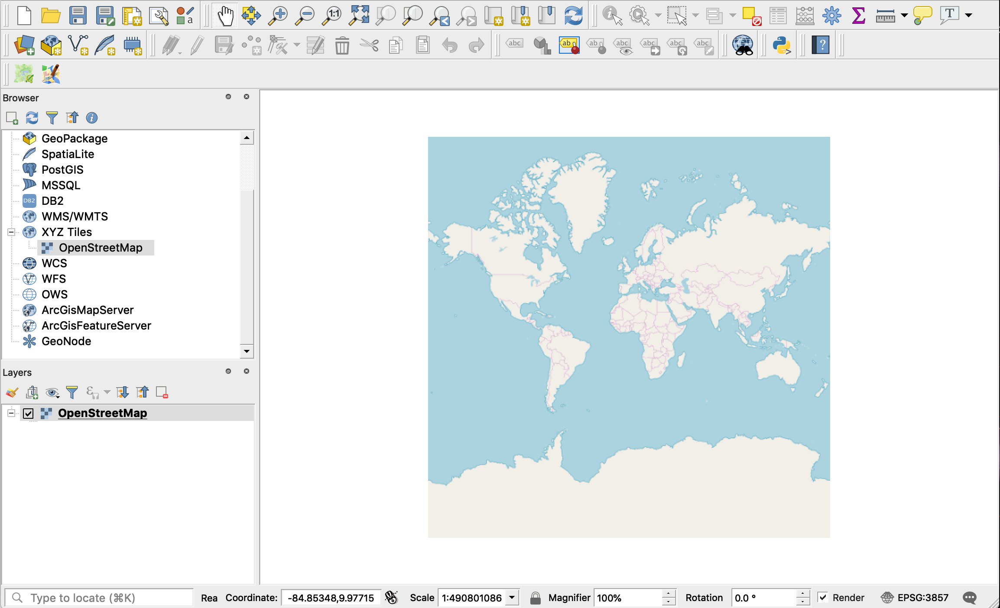{width="6.5in"
height="3.9583333333333335in"}

3.  Asegurarnos que el sistema de coordenadas del mapa es el que
    > deseamos. En este caso WGS84. Para esto debemos dar click en la
    > esquina inferior derecha de la ventana de QGIS, donde dice
    > **EPSG:3857**.

4.  En la ventana que se abre, escribir **IGNF:WGS84G** en el espacio de
    > *Filter* y seguidamente dar click en **World Geodetic System
    > 1984** que aparece en la subventana de *Coordinate reference
    > systems of the world* y dar click en *OK*. (Para entender mejor
    > qué son los sistemas de coordenadas, se recomienda ver el material
    > sobre **Coordenadas geográficas**).

> De esta manera estamos haciendo que QGIS trabaje en un sistema de
> coordenadas específico, lo que nos va a servir para poder guiar
> nuestro análisis a una ubicación específica (ciudad de Puntarenas).

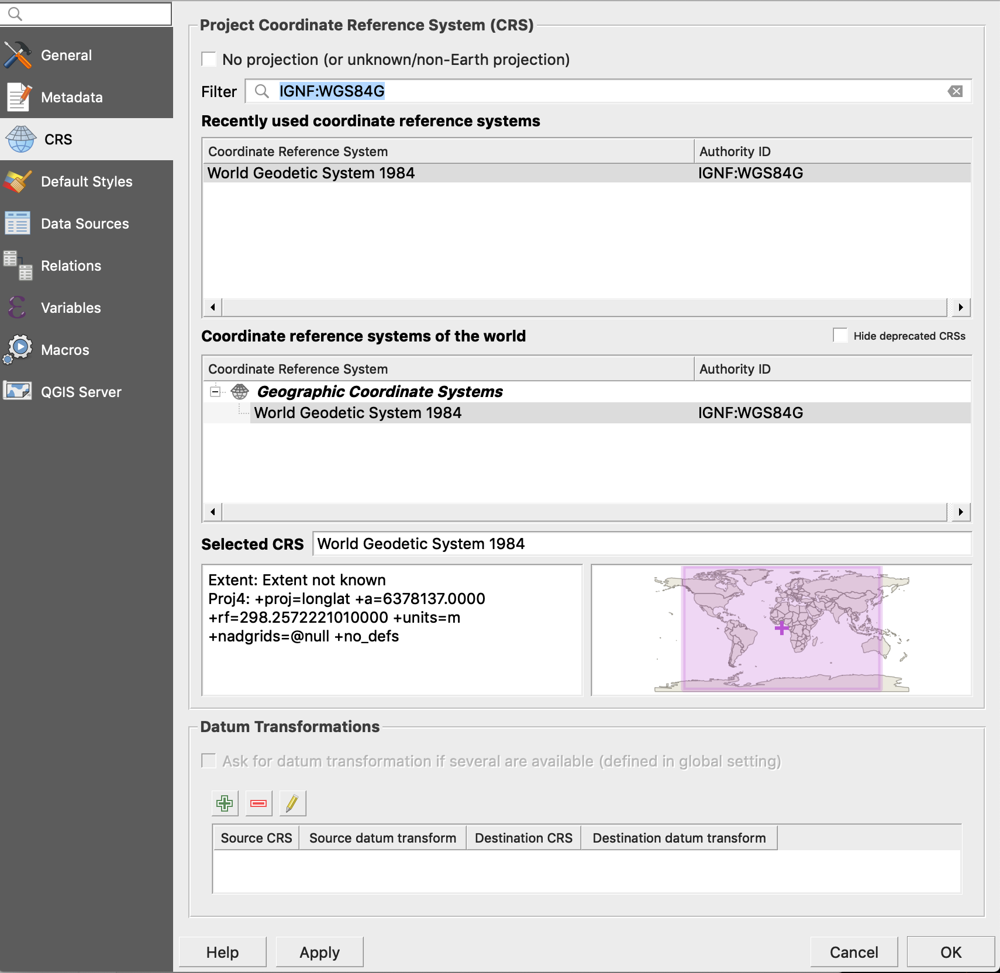{width="6.5in"
height="6.319444444444445in"}

5.  En la barra inferior de la ventana de QGIS escribir (copiar y pegar)
    > en el espacio *Coordinate:* las coordenadas del centro de la
    > ciudad de Puntarenas **-84.82353,9.97530** y la escala de
    > **1:50000** en el espacio de *Scale*. De esta manera ubicaremos
    > nuestro \"mapa\" en la ciudad de Puntarenas.

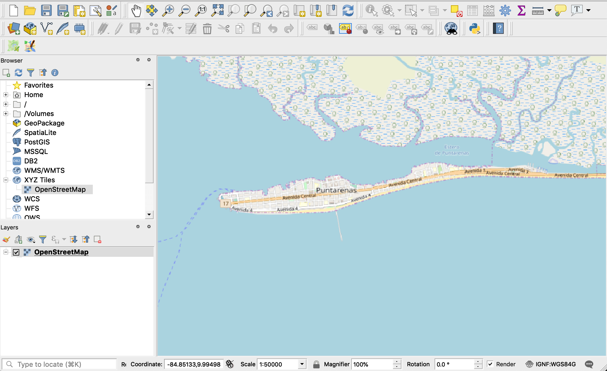{width="6.5in"
height="3.986111111111111in"}

Parte 2. Utilizando el *plugin* QuickOSM
----------------------------------------

QGIS tiene una gran cantidad de *plugins* gratuitos que permiten
realizar distintos tipos de análisis. Para este ejercicio utilizaremos
el plugin QuickOSM que nos permitirá descargar desde QGIS los datos de
OSM.

1.  Dar click en *Plugins - Manage and Install Plugins...*

> 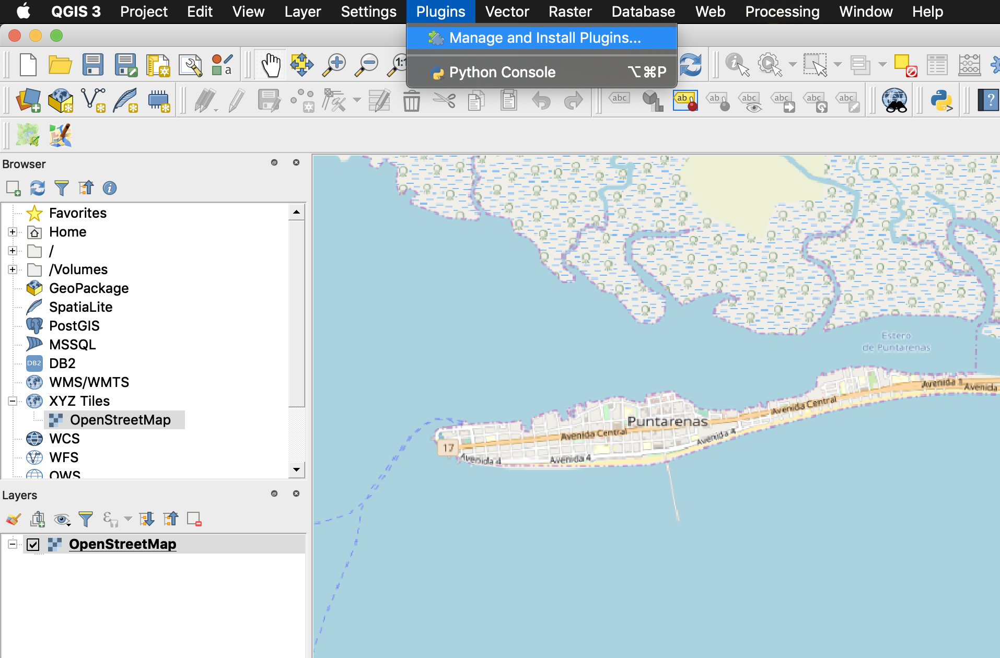{width="6.5in"
> height="4.277777777777778in"}

2.  En la ventana de Plugins escribir QuickOSM y luego en *Install
    > plugin.*

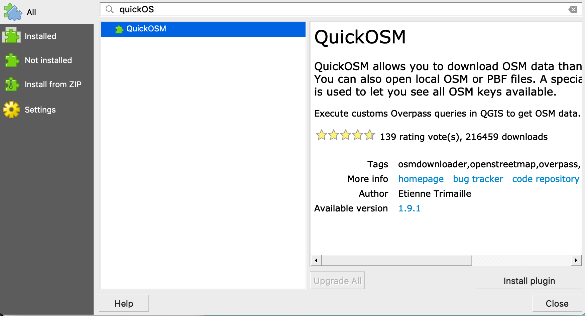{width="6.5in"
height="3.513888888888889in"}

3.  Esperar a que se descargue e instale el *plugin* y luego cerrar la
    > ventana.

4.  Abrir QuickOSM haciendo click en *Vector - QuickOSM - QuickOSM*

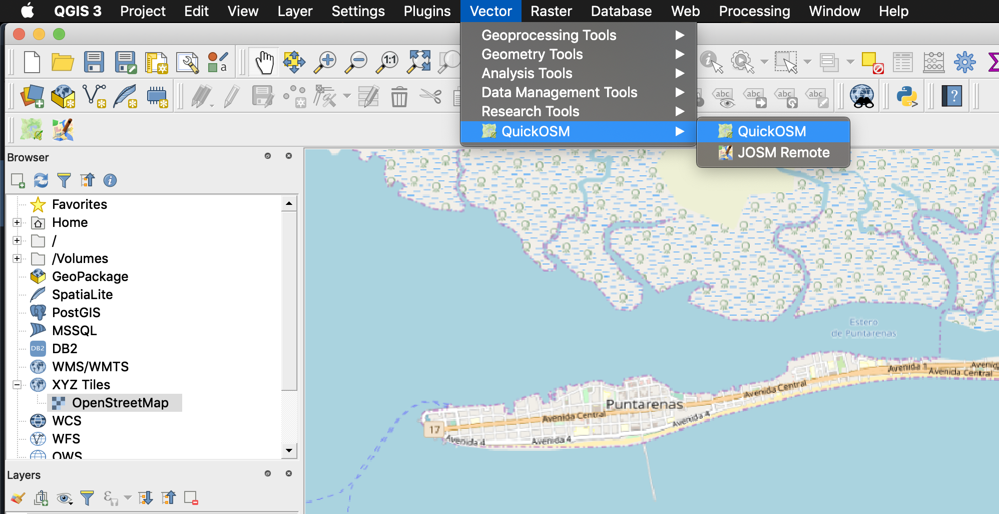{width="6.0625in"
height="3.34375in"}

5.  En la ventana de QuickOSM, seleccionar ***building*** en el menú de
    > *Key* y ***Canvas Extent*** en el menú bajo a *Value*. De esta
    > manera le estamos diciendo a QGIS que descargue únicamente los
    > objetos codificados como *edificios* en el área que está
    > desplegada en la ventana principal.

> Nota: OSM tiene una gran cantidad de códigos para los distintos
> objetos que se representan en sus mapas. La guía de todos los códigos
> que utiliza OSM se puede ver en el siguiente enlace:
> [[https://wiki.openstreetmap.org/wiki/ES:Map\_Features]{.underline}](https://wiki.openstreetmap.org/wiki/ES:Map_Features)
>
> 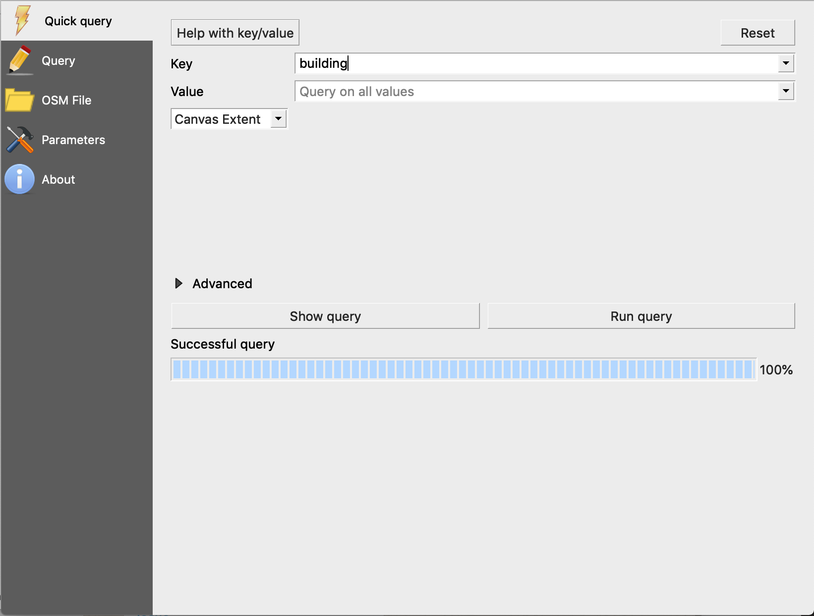{width="6.5in"
> height="4.930555555555555in"}

6.  Damos click en **Run query** para correr la búsqueda y descarga de
    > los datos.

7.  Al hacer esto QuickOSM nos descarga los puntos y polígonos de los
    > edificios que han sido digitalizados en OSM por la comunidad en
    > nuestra área de estudio.

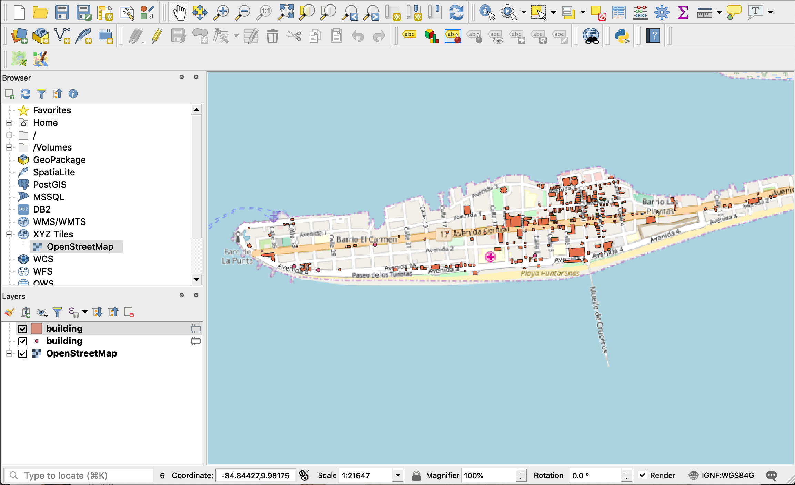{width="6.5in"
height="3.9722222222222223in"}

Parte 3. Analizando los datos de OSM
------------------------------------

Ahora que tenemos los datos en nuestro SIG podemos hacer múltiples
análisis. Lo primero es un conteo de cuantas edificaciones tenemos en
esa nueva capa.

1.  Damos click derecho en la capa *building* con ícono en forma de
    > cuadro (esto significa que el tipo de dato es polígono) y luego
    > hacemos click en *Open Attribute Table* para de esta manera ver la
    > tabla de atributos de la capa y cuantas entidades hay en ella.

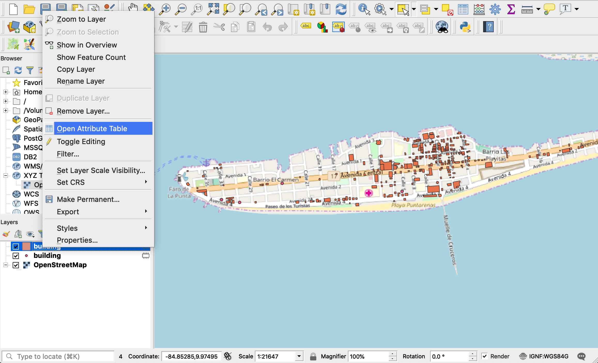{width="6.5in"
height="3.9444444444444446in"}

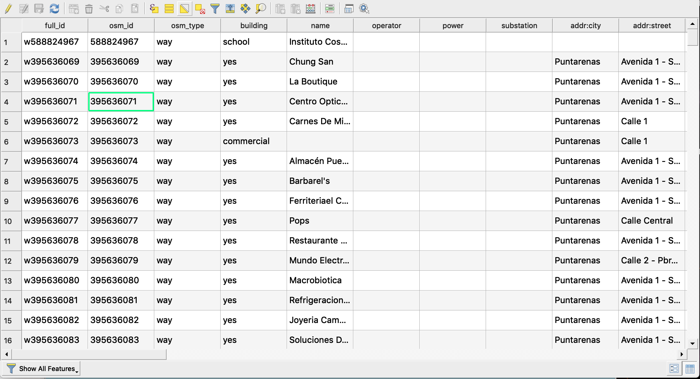{width="6.5in"
height="3.5277777777777777in"}

Si navegamos la tabla de atributos hasta el final, podemos ver que el
total de entidades que hay en esta capa ( \~ edificios) son 271 (esto
para la fecha en que se escribió el tutorial). ¿Serán estos todos los
edificios que existen en Puntarenas? Para esto podemos cargar una imagen
de GoogleEarth y hacer una comparación visual.

2.  Damos click derecho en el ***XYZ Tiles*** de la ventana *Browser* y
    > luego click en ***New Connection\...***

> 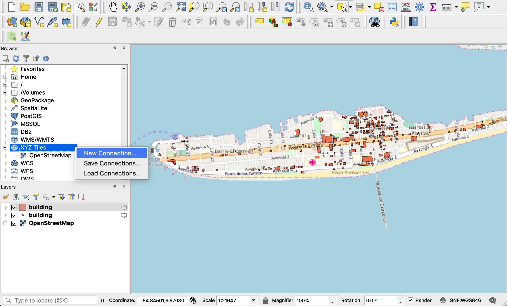{width="6.5in"
> height="3.9305555555555554in"}

3.  En la ventana de *XYZ Connection* llenar en *Name:* ***Imágenes
    > Google Earth*** y en URL copiar y pegar la siguiente dirección y
    > dar click en OK.
    > [**[http://mt0.google.com/vt/lyrs=y&hl=en&x={x}&y={y}&z={z}&s=Ga]{.underline}**](http://mt0.google.com/vt/lyrs=y&hl=en&x=%7Bx%7D&y=%7By%7D&z=%7Bz%7D&s=Ga)

> De esta manera hacemos que QGIS pueda cargar como mapa base las
> imágenes de Google Earth.
>
> Nota: en caso de querer ampliar la lista de mapas base de QGIS, pueden
> utilizar el script en Python que hizo Klas Karlsson:
> [[https://twitter.com/klaskarlsson/status/972757121933733889]{.underline}](https://twitter.com/klaskarlsson/status/972757121933733889)

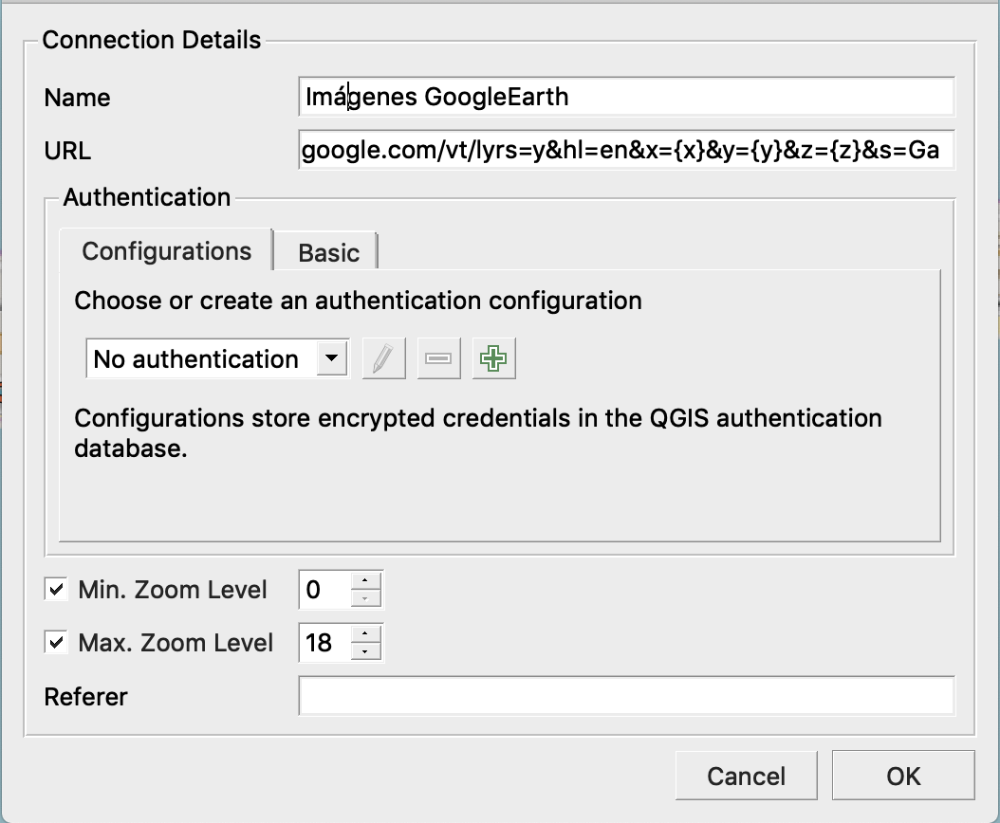{width="4.515625546806649in"
height="3.7086154855643043in"}

4.  Ya agregada la nueva conexión a las imágenes de GoogleEarth, hacemos
    > doble click en ella: *XYZ Tiles - Imágenes Google Earth*. Luego de
    > que se despliegue la imagen, en la ventana de *Layer* arrastramos
    > y soltamos esta nueva capa sobre la capa de *OpenStreetMap* para
    > de esta forma poder ver los edificios sobre la imagen.

> 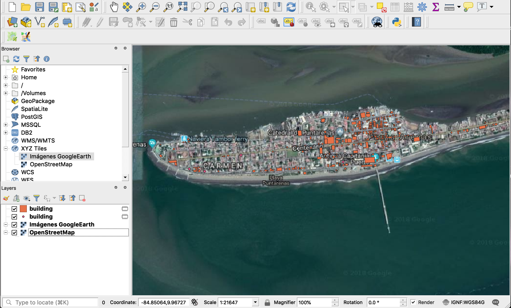{width="6.5in"
> height="3.9166666666666665in"}

Efectivamente podemos ver a simple vista que la capa de edificios de OSM
no representa todos los edificios que existen en la ciudad de
Puntarenas. ¿Qué podemos hacer si lo que queremos es saber cuantas
edificaciones hay en esta área? La primera opción es tomar el tiempo
para editar en OSM desde las imágenes áreas los edificios que hacen
falta, la otra opción es descargar todas las entidades que tiene OSM en
esta área y buscar alguna que refleje mejor el número de edificios.

5.  Volvemos a abrir QuickOSM y en este caso únicamente seleccionamos
    > *Canvas Extent* y hacemos click en *Run query*. De esta manera se
    > descargarán todos los objetos que existen en el área de estudio.

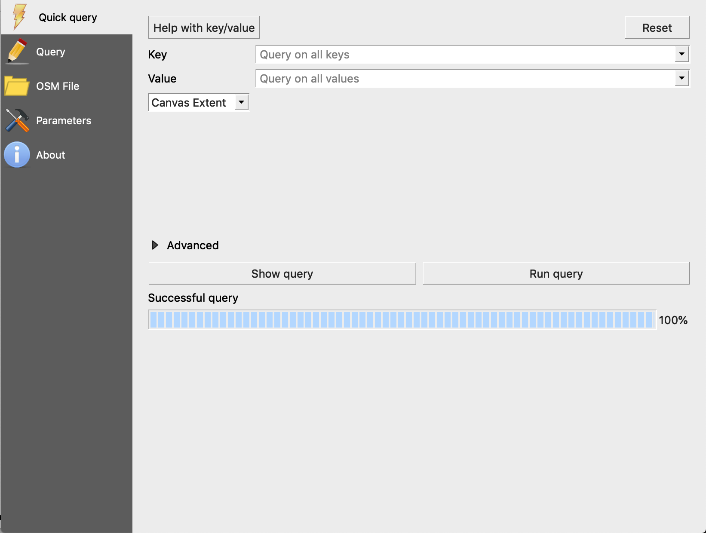{width="6.5in"
height="4.902777777777778in"}

6.  Reacomodamos las capas en la ventana *Layers* para tener la imagen
    > de GoogleEarth debajo de los nuevos puntos *allKeys*.

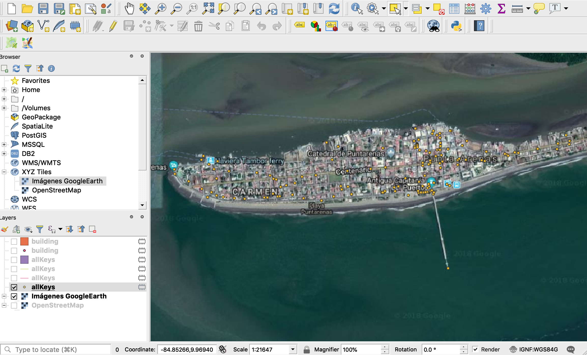{width="6.5in"
height="3.9444444444444446in"}

7.  Abrimos la tabla de atributos de esta nueva capa de puntos y vemos
    > que hay 141 entidades.

> Si también reacomodamos las capas y ponemos los polígonos de
> *building* bajo los puntos de *allKeys* vemos que en muchos casos
> estos no se sobreponen, por lo que podríamos decir a manera de un
> estimado rápido que hay más de 412 (271 polígonos + 141 puntos)
> edificaciones y puntos de interés en la ciudad de Puntarenas.
